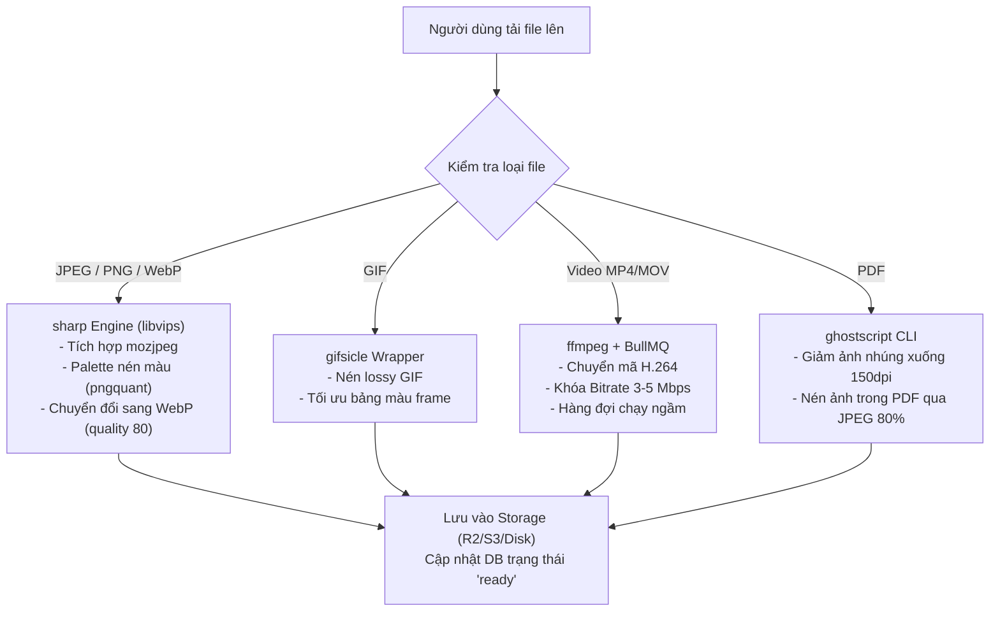

# Đề xuất: Ứng dụng Giải pháp Nén của Clop vào Hệ thống CMS

Tài liệu này đề xuất phương án xây dựng một **CMS Media Compression Pipeline** tự động trên Backend NestJS, lấy cảm hứng và sử dụng các engine nén cốt lõi tương đương với ứng dụng tối ưu hóa nổi tiếng **Clop** trên macOS.

---

## 1. Vấn đề (The Problem)

* **Bối cảnh:** Hệ thống CMS tiếp nhận rất nhiều định dạng nội dung từ người dùng: hình ảnh tĩnh (PNG, JPEG), hình ảnh động (GIF), video (MP4/MOV) và tài liệu văn phòng (PDF).
* **Vấn đề:** Nếu lưu trữ trực tiếp các tệp tin gốc chưa được tối ưu, hệ thống sẽ nhanh chóng bị quá tải dung lượng lưu trữ (Storage Overload), tiêu tốn lượng lớn băng thông mạng của server và làm chậm đáng kể tốc độ tải nội dung trên các thiết bị Player (Android TV Box cấu hình yếu).
* **Mục tiêu:** Xây dựng một quy trình tự động nén (Pipeline) trên Server để chuẩn hóa, tối ưu dung lượng và định dạng cho 100% tệp tin đa phương tiện ngay sau khi upload, đảm bảo chất lượng hiển thị gần như không đổi nhưng dung lượng giảm tối đa.

---

## 2. Tổng quan và tóm tắt giải pháp của Clop

**Clop** là một ứng dụng tối ưu hóa clipboard và tệp tin hàng đầu trên hệ điều hành macOS. Sức mạnh nén cực sâu của Clop đến từ việc tích hợp các công cụ dòng lệnh (CLI engines) mã nguồn mở tốt nhất thế giới hiện nay dưới nắp máy:

1. **`libvips`:** Engine xử lý và thay đổi kích thước (resize) hình ảnh hiệu năng cực cao, tiêu thụ rất ít bộ nhớ RAM so với ImageMagick.
2. **`pngquant`:** Công cụ nén ảnh PNG có tổn hao (lossy) tốt nhất, chuyển đổi PNG 24-bit sang 8-bit có kênh alpha mờ, giảm 70% dung lượng.
3. **`mozjpeg` / `jpegoptim`:** Bộ nén JPEG của Mozilla, tối ưu cấu trúc file JPEG và hỗ trợ Progressive JPEG giúp ảnh tải từ từ mượt mà hơn.
4. **`gifsicle`:** Công cụ nén và tối ưu hóa ảnh động GIF (hỗ trợ nén có tổn hao cho ảnh động).
5. **`ffmpeg`:** Bộ chuyển mã và nén video mạnh mẽ bậc nhất.
6. **`Ghostscript`:** Công cụ chuyên nén tài liệu PDF bằng cách tối ưu hóa và giảm dpi của hình ảnh nhúng bên trong PDF.

---

## 3. Đề xuất phương án tích hợp vào Backend CMS (NestJS Server)

Chúng ta có thể chuyển tải chính xác triết lý nén của Clop vào Backend NestJS bằng cách tích hợp các thư viện Node.js tương đương làm nhiệm vụ xử lý ngầm (Background Workers):

### A. Tối ưu ảnh tĩnh (JPEG, PNG, WebP) -> Sử dụng `sharp`
Thư viện **`sharp`** trong Node.js được viết dựa trên lõi **`libvips`** (engine của Clop), mang lại tốc độ xử lý nhanh gấp 4-5 lần so với các thư viện cũ.
* **Cơ chế nén:**
  - Tự động thay đổi kích thước (Resize) ảnh về độ phân giải tối đa (ví dụ: chiều rộng tối đa 1920px cho FullHD hoặc 3840px cho 4K).
  - Đối với **PNG**: Sử dụng tùy chọn `{ palette: true }` trong sharp để giảm màu tương tự thuật toán của `pngquant`.
  - Đối với **JPEG**: Sử dụng bộ nén `mozjpeg` được sharp tích hợp sẵn để tối ưu hóa nén.
  - Tự động chuyển đổi toàn bộ ảnh PNG/JPEG sang định dạng `.webp` với chất lượng nén `80` (dung lượng giảm 70-80% mà chất lượng hiển thị mắt thường không phân biệt được).

### B. Tối ưu ảnh động (GIF) -> Sử dụng `gifsicle`
* **Thực hiện:** Cài đặt gói `imagemin-gifsicle` hoặc gọi trực tiếp CLI của `gifsicle` thông qua Node.js `child_process`.
* **Cơ chế nén:** Loại bỏ các khung hình thừa, tối ưu hóa dải màu chung của ảnh động và áp dụng nén lossy (có tổn hao) để giảm dung lượng ảnh GIF (thường rất nặng) xuống 50-60%.

### C. Tối ưu Video -> Sử dụng `ffmpeg` & Hàng đợi `BullMQ`
Vì nén video tốn nhiều thời gian và CPU, hệ thống sẽ sử dụng hàng đợi chạy nền để xử lý bất đồng bộ, tránh làm nghẽn server.
* **Thực hiện:** Cài đặt `ffmpeg` trên server và tích hợp thư viện `fluent-ffmpeg` trong NestJS. Sử dụng `BullMQ` (Redis) để quản lý hàng đợi.
* **Cơ chế nén:**
  - Chuyển mã video sang định dạng `.mp4` chuẩn nén H.264.
  - Khóa tốc độ bitrate ở mức tối ưu cho màn hình quảng cáo (ví dụ: 3 - 5 Mbps cho FullHD), giúp video mượt mà nhưng dung lượng giảm đáng kể.
  - Giới hạn tốc độ khung hình (framerate) ở mức tối đa 30fps.

### D. Tối ưu tài liệu PDF -> Sử dụng `Ghostscript`
* **Thực hiện:** Cài đặt `ghostscript` trên server và thực hiện gọi lệnh CLI nén thông qua Node.js `child_process`.
* **Cơ chế nén:**
  - Quét tài liệu PDF và tự động giảm độ phân giải của các hình ảnh nhúng bên trong về mức `150 dpi` (độ phân giải tối ưu cho màn hình tivi/hiển thị).
  - Nén hình ảnh nhúng đó bằng JPEG chất lượng `80%`.
  - Kết quả giúp giảm dung lượng tệp PDF từ 80-90% (ví dụ từ 20MB xuống còn 2MB), giúp Player tải về cực nhanh.
