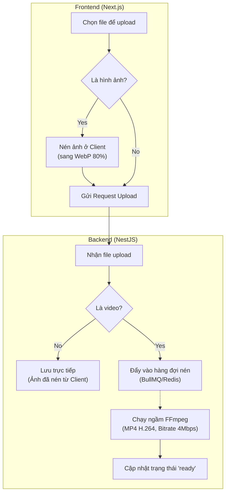

# Giải pháp Tự động Tối ưu hóa Hình ảnh và Tệp tin khi Tải lên (Media Upload Optimization)

Tài liệu này phân tích vấn đề tải lên các tệp tin đa phương tiện chưa được tối ưu dung lượng trong hệ thống Digital Signage và đề xuất các phương án giải quyết kỹ thuật ở cả phía Frontend và Backend.

---

## 1. Vấn đề (The Problem)

* **Thực trạng:** Người dùng thường tải lên các hình ảnh có độ phân giải gốc siêu cao (ví dụ: ảnh chụp máy ảnh 4K-8K nặng từ 5MB - 20MB) hoặc các video chưa được nén (dung lượng hàng trăm MB đến cả GB) để hiển thị trên màn hình quảng cáo.
* **Hậu quả:**
  1. **Quá tải kho lưu trữ (Storage Overload):** Dung lượng đĩa cứng của server (hoặc Cloud Storage như Cloudflare R2/S3) cạn kiệt rất nhanh, làm tăng chi phí vận hành.
  2. **Làm chậm thiết bị phát (Players):** Các thiết bị Android TV Box / Player phải tải tệp tin quá lớn qua mạng internet, gây tốn băng thông, tốc độ tải chậm và dễ dẫn đến lỗi không hiển thị kịp nội dung.
  3. **Quá tải phần cứng thiết bị phát:** Khi giải mã (decode) các hình ảnh/video có độ phân giải quá lớn không cần thiết, bộ nhớ RAM và CPU của thiết bị Player dễ bị quá nhiệt, đơ, giật lag hoặc tự khởi động lại ứng dụng.

---

## 2. Tổng quan và tóm tắt phương án xử lý

Để tối ưu hóa tệp tin đa phương tiện, chúng ta cần can thiệp vào quy trình tải lên (Upload Pipeline) nhằm:
- Giảm độ phân giải về mức tối đa cần thiết (ví dụ: tối đa là 4K hoặc FullHD).
- Nén chất lượng hình ảnh/video về mức tối ưu (giảm 70-90% dung lượng nhưng mắt thường khó phân biệt được sự suy giảm chất lượng).
- Chuẩn hóa định dạng tệp tin (ví dụ: chuyển ảnh sang `.webp` hoặc `.jpeg`, chuyển video sang `.mp4` chuẩn nén H.264/H.265).

Quy trình xử lý tối ưu hóa sẽ được thực hiện tại **Frontend (Client-side)** hoặc **Backend (Server-side)** hoặc kết hợp cả hai.

---

## 3. Đề xuất phương án thực hiện

### Phương án 1: Tối ưu hóa ở phía Client trước khi tải lên (Client-Side Compression)

Xử lý nén và thay đổi kích thước tệp tin ngay trên trình duyệt của người dùng trước khi gửi request upload lên Backend.

* **Cách thức thực hiện:**
  - **Đối với Hình ảnh:** Sử dụng các thư viện JavaScript nhẹ như `browser-image-compression` hoặc vẽ ảnh lên HTML5 Canvas để:
    - Resize ảnh về kích thước tối đa chỉ định (ví dụ: tối đa chiều rộng 1920px hoặc 3840px).
    - Nén chất lượng ảnh (quality đặt khoảng 80-85%).
    - Xuất ra định dạng `.webp` có dung lượng cực nhẹ trước khi gửi FormData.
  - **Đối với Video:** Rất khó tối ưu hóa hiệu quả ở client vì việc giải mã và nén video bằng WebAssembly (ví dụ FFmpeg.wasm) chạy trên trình duyệt cực kỳ chậm và tiêu tốn nhiều RAM/CPU của máy tính người dùng.
* **Ưu điểm:**
  - Tiết kiệm băng thông tải lên cho người dùng và giảm thời gian chờ đợi khi upload.
  - Server hoàn toàn không tốn tài nguyên CPU để xử lý ảnh.
* **Nhược điểm:** Chỉ xử lý tốt được hình ảnh, không giải quyết được vấn đề video nặng.

---

### Phương án 2: Tối ưu hóa ở phía Server sau khi nhận tệp (Server-Side Optimization) - KHUYÊN DÙNG

Khi người dùng tải tệp lên, Server NestJS sẽ tiếp nhận, lưu tạm thời và đưa vào một đường ống xử lý tối ưu hóa trước khi lưu trữ chính thức.

* **Cách thức thực hiện:**
  - **Đối với Hình ảnh:** Sử dụng thư viện **`sharp`** (thư viện xử lý ảnh siêu nhanh cho Node.js):
    - Tự động thay đổi kích thước (Resize) hình ảnh nếu vượt quá độ phân giải 4K (3840x2160).
    - Chuyển đổi định dạng ảnh sang `.webp` (định dạng nén thế hệ mới của Google giúp giảm 30% dung lượng so với JPEG mà vẫn giữ nguyên chất lượng).
    - Thiết lập mức nén chất lượng (quality) ở khoảng `80`.
  - **Đối với Video:** Sử dụng công cụ hệ thống **`ffmpeg`** thông qua thư viện Node.js `fluent-ffmpeg`:
    - Chuyển mã (Transcode) video sang định dạng `.mp4` mã hóa chuẩn H.264.
    - Cấu hình Bitrate tối ưu (ví dụ: giới hạn ở mức 3 - 5 Mbps cho video FullHD, đủ để hiển thị sắc nét trên màn hình quảng cáo lớn).
    - Giới hạn tốc độ khung hình (framerate) tối đa là 30fps.
  - **Quản lý hàng đợi (Background Processing Queue):** Vì việc chuyển mã video rất tốn CPU và thời gian, chúng ta cần sử dụng hệ thống hàng đợi **`BullMQ`** (hoặc `NestJS Queue` kết hợp Redis):
    - Khi người dùng upload video, server lập tức lưu tệp tạm thời, ghi nhận bản ghi Media vào DB với trạng thái `processing` (đang xử lý) và trả về phản hồi thành công ngay lập tức để người dùng không phải chờ đợi.
    - Tác vụ tối ưu video sẽ được thực hiện chạy ngầm (background job) trong hàng đợi.
    - Sau khi nén xong, server lưu file nén chính thức, xóa file tạm, cập nhật trạng thái Media thành `ready` (sẵn sàng). Các thiết bị Player chỉ tải và phát các tệp tin có trạng thái `ready`.

* **Ưu điểm:**
  - Tối ưu hóa triệt để và toàn diện cho cả hình ảnh, video và các định dạng tài liệu khác.
  - Đảm bảo 100% tài nguyên lưu trữ trên Storage được chuẩn hóa, dung lượng nhỏ gọn và định dạng tương thích tốt nhất với thiết bị Player.
* **Nhược điểm:** Server cần cài đặt thêm `ffmpeg` và tiêu tốn tài nguyên CPU/RAM khi xử lý transcode video.

---

### Phương án 3: Giải pháp kết hợp (Hybrid Approach)

Kết hợp ưu điểm của cả 2 phương án trên để đạt hiệu quả tối đa:

1. **Ở phía Frontend (Client):** Tự động nén và resize hình ảnh về định dạng `.webp` chất lượng 80% trước khi bấm gửi. Việc này giúp giảm ngay 90% dung lượng ảnh tải lên, tiết kiệm băng thông đường truyền và thời gian chờ đợi.
2. **Ở phía Backend (Server):** Chỉ tập trung xử lý tối ưu hóa Video bằng hàng đợi chạy ngầm (Queue) thông qua `ffmpeg`.

---

### Lộ trình triển khai khuyến nghị:

1. **Giai đoạn 1:** Cài đặt thư viện `sharp` trên backend NestJS để tự động tối ưu hóa và nén hình ảnh ngay khi nhận được request upload.
2. **Giai đoạn 2:** Cài đặt `ffmpeg` trên server và thiết lập hàng đợi `Bull` để xử lý nén/transcode video chạy nền (background job) bất đồng bộ.
