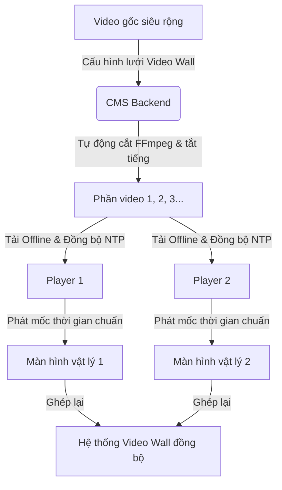

# Hướng dẫn Cấu hình & Sử dụng Đồng bộ Phát đa màn hình (Video Wall)

Hệ thống hỗ trợ đồng bộ phát đa màn hình vật lý chạy độc lập để ghép thành một màn hình lớn duy nhất (Video Wall) mà không cần bộ điều khiển phần cứng đắt tiền. Tài liệu này hướng dẫn chi tiết cách cấu hình, vận hành và tối ưu hóa hệ thống bằng cơ chế **Tự động Cắt Video ở Backend (Auto-Slicing)** hoặc **Tự chuẩn bị thủ công**.

---

## 1. Tổng quan cơ chế hoạt động

Hệ thống hoạt động dựa trên nguyên lý **Video Slicing** để tối ưu hóa tài nguyên phần cứng đầu phát (Player):

1. **Phân đoạn hình ảnh (Slicing):** Video gốc siêu rộng được chia nhỏ thành các phần tương ứng với cấu hình lưới vật lý của các màn hình.
2. **Lọc nội dung theo thiết bị:** Mỗi đầu phát (Player) chỉ tải về và giải mã phần video nhỏ tương ứng tại vị trí của nó trên lưới, giúp tối ưu hóa hiệu năng, giảm tải CPU/GPU thay vì phải giải mã toàn bộ video siêu rộng.
3. **Đồng bộ thời gian tuyệt đối (NTP Sync):** Các Player liên tục đồng bộ thời gian hệ thống chuẩn xác với máy chủ thông qua giao thức NTP đo RTT.
4. **Phát đồng bộ và sửa lệch pha (Drift Correction):** Tất cả Player cùng phát tệp tin của mình dựa theo mốc thời gian tuyệt đối của Server. Nếu video chạy nhanh hoặc chậm hơn thời gian chuẩn quá **0.5 giây**, Player tự động tua (`seek`) về mốc chuẩn tức thời.



---

## 2. Phương pháp 1: Tự động Cắt Video ở Backend (Khuyên dùng)

Đây là tính năng thông minh giúp người dùng chỉ cần upload **1 tệp video duy nhất**, hệ thống CMS sẽ tự động thực hiện tất cả các công đoạn cắt nhỏ và phân bổ thiết bị phát.

### Bước 1: Tải video gốc siêu rộng lên thư viện

1. Đăng nhập vào **Web CMS Dashboard**.
2. Đi tới mục **Tài nguyên (Media)** và tải lên video nguồn của bạn (ví dụ: video siêu rộng 3840x1080 dành cho lưới 1x2 hoặc 5760x1080 dành cho lưới 1x3).

### Bước 2: Tạo Playlist cấu hình Video Wall

1. Vào mục **Danh sách phát (Playlists)** và bấm **Tạo danh sách phát mới**.
2. Nhập tên Playlist (ví dụ: _Video Wall Sảnh Chính_) và mô tả.
3. Tại mục **Chế độ phát**, chọn **Đồng bộ**.
4. Tại mục **Loại đồng bộ**, click chọn **Video Wall**.
5. Nhập cấu hình ma trận lưới màn hình của bạn:
   - **Số hàng (Rows):** Số hàng màn hình vật lý xếp chồng (ví dụ: `1`).
   - **Số cột (Columns):** Số cột màn hình xếp ngang (ví dụ: `3`).
6. Trong danh sách tài nguyên phía dưới, bấm chọn tệp video nguồn siêu rộng bạn vừa tải lên ở Bước 1.

### Bước 3: Ánh xạ thiết bị trên sơ đồ lưới (Simulator)

1. Tại khu vực trung tâm màn hình, hệ thống sẽ tự động vẽ lưới mô phỏng **Video Wall Simulator** tương ứng với số hàng và số cột bạn đã nhập.
2. Với mỗi ô trên lưới ma trận (ví dụ: Ô 1x1, Ô 1x2...), hãy nhấp vào menu thả xuống và chọn Player vật lý tương ứng sẽ được lắp đặt tại vị trí đó.
3. Bấm **Lưu Playlist**.

> [!NOTE]
> Hệ thống sẽ xử lý cắt video trực tiếp trong vòng 2-5 giây. Sau khi lưu thành công, Backend tự sinh ra các slide chứa các phần video đã cắt tương ứng và ánh xạ thiết bị tự động. Mọi âm thanh của các phần cắt sẽ được tự động loại bỏ (`-an` trong FFmpeg) để tránh gây ra hiện tượng hỗn loạn tiếng khi ghép màn hình.

### Bước 4: Xem trước (Preview) Video Wall trực quan

Sau khi đã lưu Playlist thành công, bạn không cần cài đặt lên thiết bị thực tế để test. CMS đã tích hợp sẵn trình giả lập:

1. Tại tab **Danh sách phát (Playlists)**, tìm Playlist Video Wall bạn vừa tạo.
2. Bấm nút **Xem trước (Preview)** (biểu tượng con mắt hoặc nút Play).
3. Hệ thống sẽ mở ra một cửa sổ mô phỏng Video Wall gồm lưới các màn hình ghép đặt cạnh nhau.
4. Bấm **Phát (Play)**, tất cả các phân đoạn video con đã cắt sẽ cùng chạy đồng bộ song song thời gian thực trên màn hình giả lập, giúp bạn dễ dàng đánh giá khớp hình ảnh trước khi lập lịch chính thức.

---

## 3. Phương pháp 2: Tự chuẩn bị và Cắt Video Thủ công (Tùy chọn)

Nếu bạn muốn tự chuẩn bị các tệp video đã cắt sẵn bằng phần mềm chỉnh sửa video chuyên nghiệp (như Adobe Premiere) hoặc tự viết lệnh FFmpeg để kiểm soát chất lượng nén, bạn có thể thực hiện theo quy trình thủ công sau:

### Bước 1: Sử dụng FFmpeg cắt video cục bộ

Chạy các dòng lệnh mẫu sau trên máy tính của bạn để cắt video gốc thành lưới 1x3 (3 màn hình ngang):

```bash
# Cắt phần bên trái (Player 1)
ffmpeg -i input_wide.mp4 -filter:v "crop=1920:1080:0:0" -an part_1.mp4

# Cắt phần ở giữa (Player 2)
ffmpeg -i input_wide.mp4 -filter:v "crop=1920:1080:1920:0" -an part_2.mp4

# Cắt phần bên phải (Player 3)
ffmpeg -i input_wide.mp4 -filter:v "crop=1920:1080:3840:0" -an part_3.mp4
```

> [!WARNING]
> Tất cả các phần video cắt ra phải có **cùng tổng thời lượng (duration)** và định dạng codec để quá trình đồng bộ hoạt động chính xác tuyệt đối. Vui lòng thêm cờ `-an` để tắt âm thanh.

### Bước 2: Tạo Playlist và gán thủ công trên CMS

1. Tải cả 3 tệp video đã cắt lên mục **Media** trên Web CMS.
2. Tạo Playlist mới và bật **Đồng bộ nhóm (Sync Group)**.
3. Chọn Loại đồng bộ là **Tiêu chuẩn**.
4. Thêm các slide:
   - **Slide 1:** Gán video `part_1.mp4`, trong danh sách thiết bị phát mục tiêu (targetDeviceIds) tích chọn **Player 1**.
   - **Slide 2:** Gán video `part_2.mp4`, tích chọn thiết bị phát mục tiêu là **Player 2**.
   - **Slide 3:** Gán video `part_3.mp4`, tích chọn thiết bị phát mục tiêu là **Player 3**.
5. Bấm **Lưu Playlist**.

---

## 4. Lập lịch phát hàng loạt (Multi-Scheduling)

Sau khi hoàn tất tạo Playlist đồng bộ (bằng Phương pháp 1 hoặc 2):

1. Đi tới mục **Lập lịch (Schedules)** và bấm **Tạo lịch trình**.
2. Chọn Playlist đồng bộ vừa tạo.
3. Hệ thống sẽ tự động phân tích cấu hình `deviceMapping` của Playlist và chọn toàn bộ các Player liên quan làm thiết bị áp dụng lịch trình này. Bạn không cần phải chọn thủ công từng máy.
4. Đặt khoảng ngày hoạt động, khung giờ phát sóng và lưu lại.

---

## 5. Cơ chế kỹ thuật tự động vận hành ở Player Client

Khi các Player (sử dụng hệ điều hành Android/iOS) khởi chạy ứng dụng, các dịch vụ ngầm sau sẽ tự động hoạt động:

### A. Đo thời gian hệ thống (Time Synchronization)

- Ngay khi khởi động và định kỳ mỗi **5 phút**, Player gửi tín hiệu đo đến API máy chủ `GET /api/player/time`.
- Player tính toán thời gian trễ mạng (RTT) và lưu trữ độ lệch đồng hồ (`clockOffset`). Thời gian phát sóng đồng bộ sẽ bằng: `synchronizedTime = LocalTime + clockOffset`.

### B. Tải tài nguyên và phát Offline (Smart Caching)

- Định kỳ mỗi **30 giây**, Player gọi API đồng bộ để kiểm tra lịch trình mới.
- Player tự động tải ngầm các file video mới về bộ nhớ trong. Các file được lưu trữ và so khớp bằng mã băm `MD5 checksum` để tránh việc tải lại các file trùng lặp.
- Chỉ khi nào **toàn bộ** các file trong danh sách phát mới được tải về thành công, Player mới chuyển trạng thái hiển thị để tránh hiện tượng màn hình đen.

### C. Chống lệch pha (Drift Correction)

- Khi phát video, Player tự động chạy dịch vụ giám sát lệch khung hình mỗi **1.5 giây**.
- Nếu vị trí phát thực tế của video lệch so với vị trí chuẩn thời gian thực tuyệt đối (`playbackTime = synchronizedTime % VideoDuration`) vượt quá **0.5 giây**, Player tự động tua nhanh hoặc chậm lại để khớp chính xác theo thời gian thực của máy chủ.

---

## 6. Xử lý sự cố thường gặp (Troubleshooting)

| Sự cố                                                           | Nguyên nhân có thể                                                                              | Giải pháp                                                                                                                                                                             |
| :-------------------------------------------------------------- | :---------------------------------------------------------------------------------------------- | :------------------------------------------------------------------------------------------------------------------------------------------------------------------------------------ |
| **Hình ảnh trên các màn hình ghép bị lệch pha lớn (lệch hình)** | Thiết bị mất kết nối mạng hoặc độ trễ mạng quá cao khi đo NTP lúc khởi chạy.                    | Kiểm tra kết nối mạng của các thiết bị. Khởi động lại ứng dụng Player để thiết bị đo lại NTP chuẩn xác.                                                                               |
| **Màn hình hiển thị đen, không chạy nội dung**                  | 1. Player chưa tải xong video con.<br>2. Chưa gán đúng thiết bị mục tiêu trong lưới Video Wall. | 1. Đợi thiết bị tải xong (hoặc kiểm tra tiến độ tải trong mục giám sát thiết bị).<br>2. Mở Playlist Editor trên Web CMS và đảm bảo đã chọn đúng Player cho ô lưới đó.                 |
| **Có âm thanh phát ra không đồng đều gây vang/ồn**              | Video nguồn hoặc video cắt chưa được tắt tiếng.                                                 | Đối với phương án tự động, hệ thống đã tắt âm thanh. Nếu cấu hình thủ công, hãy đảm bảo bạn dùng cờ `-an` khi cắt video bằng FFmpeg hoặc tắt âm lượng trực tiếp trên màn hình vật lý. |
