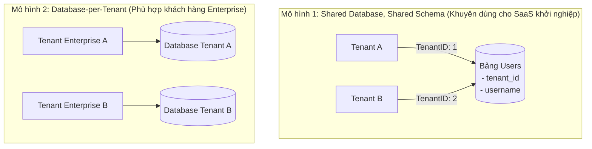
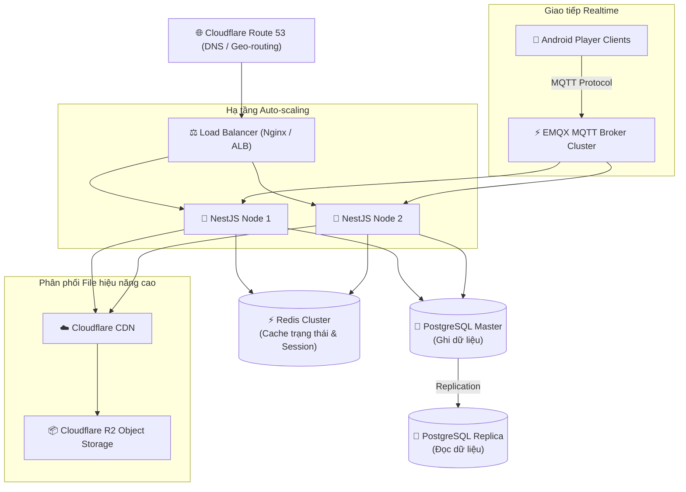

# Kiến trúc mở rộng hệ thống sang mô hình SaaS (Software-as-a-Service)

Tài liệu này đề xuất phương án tái cấu trúc hệ thống **CMS Digital Signage** để chuyển đổi từ mô hình đơn tổ chức (Single-tenant) sang mô hình kinh doanh đám mây đa người thuê (Multi-tenant SaaS) với khả năng tự động thanh toán, phân bổ tài nguyên và mở rộng hạ tầng khi lượng khách hàng tăng trưởng.

---

## 1. Mô hình Đa người thuê (Multi-tenancy Architecture)

Để phục vụ nhiều khách hàng (Tenants) dùng chung một hệ thống phần mềm mà dữ liệu vẫn được cách ly an toàn, chúng ta cần lựa chọn mô hình lưu trữ phù hợp:

### Giải pháp đề xuất cho dự án:
* **Tenant Isolation (Shared Database, Shared Schema):**
  - Thêm trường `tenantId` (UUID) vào tất cả các bảng dữ liệu chính (`User`, `Device`, `Media`, `Playlist`, `Schedule`).
  - Sử dụng tính năng **Prisma Client Extensions** để viết middleware tự động chèn bộ lọc `where: { tenantId }` vào mọi câu lệnh tìm kiếm, cập nhật hoặc xóa dữ liệu để tránh rò rỉ dữ liệu giữa các khách hàng.
* **Cơ chế tách Tenant từ Request:**
  - **Subdomain-based:** Khách hàng A truy cập qua `tenant-a.cdmsignage.com`, khách hàng B qua `tenant-b.cdmsignage.com`. Backend dựa trên Header `Host` để xác định `tenantId`.
  - **Header-based:** Token JWT sau khi đăng nhập chứa sẵn thông tin `tenantId` của User, Backend tự động trích xuất thông tin này từ request context.

---

## 2. Quản lý phân quyền & Tổ chức phân cấp (Organizations & RBAC)

Khách hàng mua dịch vụ SaaS thường là các doanh nghiệp hoặc chuỗi cửa hàng, họ cần phân quyền quản lý cho nhiều nhân sự cấp dưới.

* **Phân cấp tổ chức:**
  - Cấu trúc: `Tenant` (Khách hàng đăng ký) -> `Organizations / Branches` (Chi nhánh cửa hàng) -> `Devices` (Màn hình thuộc chi nhánh).
* **Hệ thống Phân quyền (Role-Based Access Control - RBAC):**
  - **Tenant Owner (Admin tối cao của khách hàng):** Quản lý thanh toán, phân quyền người dùng nội bộ, xem toàn bộ màn hình.
  - **Content Creator (Người tạo nội dung):** Chỉ được phép thiết kế playlist, upload media.
  - **Branch Manager (Quản lý chi nhánh):** Chỉ được xem và lập lịch phát cho các màn hình thuộc chi nhánh được phân công.

---

## 3. Hệ thống Subscription, Billing & Quản lý hạn mức (Monetization)

* **Tích hợp cổng thanh toán (Payment Gateway):**
  - Tích hợp **Stripe** hoặc **Paypal** để tự động trừ tiền hàng tháng/hàng năm của khách hàng (Recurring Billing).
  - Tích hợp webhook để Backend tự động kích hoạt, gia hạn hoặc khóa tài khoản khi có thay đổi trạng thái thanh toán.
* **Quản lý hạn mức (Limits & Quotas):**
  - Cấu hình các gói dịch vụ (Free, Starter, Pro, Enterprise).
  - Backend kiểm tra giới hạn tài nguyên trước khi cho phép thực hiện hành động:
    - **Số lượng màn hình (License Limit):** Chặn liên kết thiết bị mới nếu số lượng Player đã vượt gói cước.
    - **Dung lượng lưu trữ (Storage Quota):** Chặn upload file mới nếu tổng dung lượng media vượt quá hạn mức của gói cước (ví dụ: gói Free được 1GB, gói Pro được 50GB).

---

## 4. Kiến trúc Mở rộng Hạ tầng (Infrastructure Scalability)

Khi có hàng vạn thiết bị Android Player kết nối đồng thời và liên tục tải các file video dung lượng lớn, hạ tầng cần được mở rộng theo chiều ngang (Scale-out):

### Các thành phần chính trong kiến trúc SaaS mở rộng:
1. **Stateless API Servers:**
   - Đóng gói Backend NestJS vào Docker Container và triển khai trên **Kubernetes** để tự động mở rộng số lượng node chạy API dựa theo lưu lượng tải (HPA - Horizontal Pod Autoscaler).
2. **Database Clustering:**
   - Phân tách Database thành 1 Node ghi (Master) và nhiều Node đọc (Replicas) để giảm tải cho PostgreSQL.
   - Cache các truy vấn lặp lại nhiều lần hoặc dữ liệu tĩnh bằng **Redis Cluster**.
3. **Phân phối video qua CDN:**
   - Sử dụng **Cloudflare R2** hoặc AWS S3 lưu trữ media gốc, kết hợp với **Cloudflare CDN** để phân phối video tĩnh tốc độ cao và miễn phí phí băng thông truyền tải (Egress Fee).
4. **Hạ tầng kết nối thiết bị chuyên dụng (MQTT Broker):**
   - Không cho thiết bị kết nối trực tiếp vào NestJS API. Thiết bị sẽ kết nối với một **MQTT Broker** chuyên dụng (như **EMQX** hoặc **HiveMQ**) có khả năng duy trì hàng triệu kết nối TCP đồng thời với chi phí tài nguyên cực thấp. EMQX sẽ cầu nối đẩy tin nhắn sang NestJS API thông qua webhooks hoặc queue (RabbitMQ).
